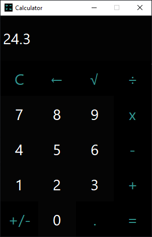

# Simple GUI Calculator
## General info:
This project is a simple calculator with graphical user interface. It is developed in Java using Swing GUI toolkit.
## Screenshot:

## How to run:
1. Download the ZIP and extract it or clone the project by typing in the bash the following command:
   git clone https://github.com/se668/Simple-GUI-Calculator.git
   
2. Import the project folder to your IDE and run the app.
## Built with:
IDE: IntelliJ IDEA  
JDK version: 15.0.1 